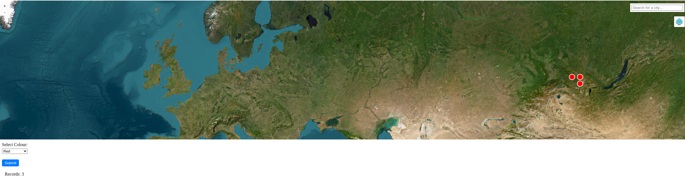

# CSharp-GeoCRUD-Docker-API
This project provides a simple CRUD API built in **C#** and deployed in a Docker container, utilizing a PostgreSQL database. The API supports basic data operations: storing data via `POST` requests and retrieving data via `GET` requests.

Additionally, the project includes a user-friendly GUI accessible at `http://localhost:9876`. The interface features an interactive map with both satellite and street view options, leveraging **OpenLayers** for map rendering. It also includes a search field that enables users to look up cities and visualise geospatial data stored in the database, with the ability to request and display the data directly on the map in real-time.



This application serves as a demonstration of a CRUD API with integrated geospatial data visualization and database connectivity.

## Requirements
* **Docker**: Ensure Docker is installed on your machine to build and run the containerised application.


## Setup Instructions
1) **Build the Docker image**: Navigate to the application directory `csharp-geocrud-docker-api` and build the image using: `docker compose build`. This command will compile the image for the CRUD application.
2) **Start the containers**: After a successful build, start the containers with: `docker compose up`.
3) **Access the application**: The application will be available at `http://localhost:9876`. Note that the port may be modified in the `docker-compose.yml` if necessary.
4) **Create the database table**:
    * Connect to the database container: `docker exec -ti dbgeocrud psql -U postgres`
    * Verify the table does not already exist by running: `\dt`
    * Create the required table with the following `SQL` command:
    ```
    CREATE TABLE geo (
        id SERIAL PRIMARY KEY,
        timestamp VARCHAR(255) NOT NULL,
        latitude DECIMAL(12, 9) NOT NULL,
        longitude DECIMAL(12, 9) NOT NULL,
        colour VARCHAR(255) NOT NULL
    );
    ```
5) **Add data**:
    * To add data, issue a `POST` request to `http://localhost:9876/api/geo` with the `Content-Type` set to `application/json`. The request body should be in the following format:
    ```
    {
        "TimeStamp": STRING,
        "Latitude": NUMERICAL,
        "Longitude": NUMERICAL,
        "Colour": STRING
    }
    ```
    For example:
    ```
    {
        "TimeStamp": "your_timestamp",
        "Latitude": 53.32,
        "Longitude": 95,
        "Colour": "green"
    }
    ```
    or as a list:
    ```
    [
        {
            "TimeStamp": "your_timestamp",
            "Latitude": 53.82,
            "Longitude": 95,
            "Colour": "green"
        },
        {
            "TimeStamp": "your_timestamp",
            "Latitude": 55.32,
            "Longitude": 96,
            "Colour": "red"
        }
    ]
    ```
    * The application will check for duplicate records, ensuring that entries with the same coordinates and timestamp are not added more than once.

6) **Retrieve data**:
    * The GUI allows users to filter records by selecting a colour from a dropdown list.
    * For example, a `GET` request to `http://localhost:9876/api/geo/colour/?colour=%23FF0000` will return records filtered by the specified colour. Omitting the colour parameter, as in `http://localhost:9876/api/geo/colour`, will return all records.
    * The `GET` request for testing the API is `http://localhost:9876/api/geo/test`.
    * A `GET` request `http://localhost:9876/api/geo/2`, will return the record with `Id=2`.
7) **Update a record**:
    * For example, a `PUT` request to `http://localhost:9876/api/geo/2` with the `Content-Type` set to `application/json`, will update the record with `Id=2`. If the `Id` doesn't exist, it will return a message, that `Id X not found`. The request body should be:
    ```
    {
        "Id": 2,
        "TimeStamp": "newtimestamp",
        "Latitude": 52.430000000,
        "Longitude": 9.000000000,
        "Colour": "Red"
    }
    ```

8) **Delete a record**:
    * For example, a `DELETE` request to `http://localhost:9876/api/geo/2` with the `Content-Type` set to `application/json`, will delete the record with `Id=2` (if it exists).